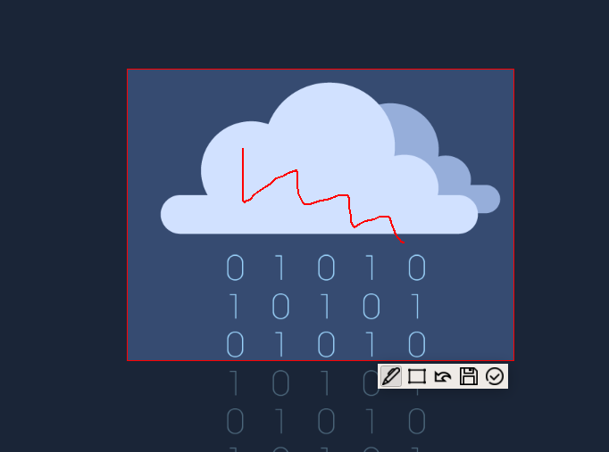

# 简介
由QT编写的截图小程序，目前可在linux下正常使用。

由于我使用QT4.8.3编译发现存在复制图片到剪贴板超时的问题，因此改用QT5.9.8进行编译。如果您在使用时发现了同样的问题，可以尝试切换QT版本。

在源码根目录下依次执行

```shell
$ qmake
$ make
```

程序编译完成后将生成与源码目录的`./bin`下，名为`screenshot`

## 界面及操作

应用程序界面如下：




工具栏从左到右依次为：画笔、矩形框、撤销、保存、完成截图到剪贴板，撤销功能最多回退五次。

红框内为截图选区，双击或单机完成按钮时能将截图复制到剪贴板。

单机右键可依次退出选区（重新进行选区）和退出截图程序，按esc可直接退出截图程序。

在ubuntu下，可配置快捷键到截图应用程序，实现随时随手截图。

# 待完善功能

1. 画笔、矩形框选择笔刷颜色和粗细
2. 截图选区的移动和大小调整
3. 文字添加
4. 撤销的逻辑优化：撤销执行后保持上次选择的画笔不变
5. 目前存在该程序重复调用的问题，即，通过快捷键能做到我截我自己，以及它能通过alt+tab等方式被后台，但我觉得问题不大

